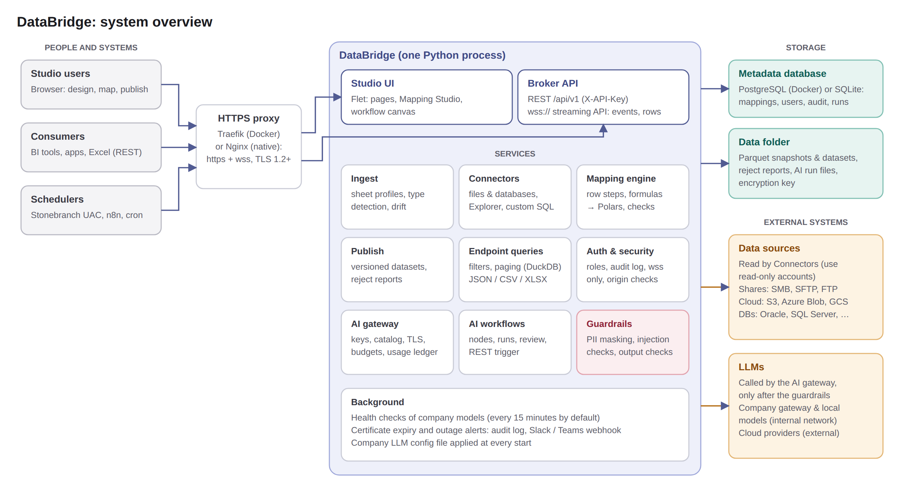

# DataBridge

Map spreadsheets, files and database tables to a target schema with drag-and-drop arrows, then serve the result as REST endpoints.

- **Studio (Flet)** at `/`: connections, object explorer, sheet-profile import wizard, target schemas, the Mapping Studio, endpoints, API keys, run history.
- **Broker API (FastAPI)** at `/api/v1`, with interactive docs at `/api/docs`.

## Architecture



More diagrams: [data flow](databridge/docs/guide/img/architecture-data-flow.png),
[AI call path](databridge/docs/guide/img/architecture-ai.png),
[deployment](databridge/docs/guide/img/architecture-deployment.png). They are also in the in-app guide
(Documentation → Architecture). Regenerate them after changes with `python scripts/make_diagrams.py`
(needs Playwright's Chromium; pass `--roboto`/`--roboto-bold` TTF paths to match the studio font).

## Run locally (Windows, macOS, Linux)

```powershell
python -m venv .venv
.venv\Scripts\activate            # macOS/Linux: source .venv/bin/activate
pip install -r requirements.txt
pip install -r requirements-drivers.txt   # optional: Oracle, Postgres, MySQL, SQL Server, SMB, SFTP
python -m databridge.demo                 # optional: sample data + prints an admin API key
uvicorn databridge.main:app --reload --port 8000   # development; servers use: python -m databridge.serve
```

Open http://localhost:8000. The demo creates a messy vendor spreadsheet source, a target, a published mapping, a `customer-orders` endpoint, a SQLite "ERP" connection and a folder connection.

```bash
curl -H "X-API-Key: <key from demo>" "http://localhost:8000/api/v1/data/customer-orders?region=East"
curl -H "X-API-Key: <key>" "http://localhost:8000/api/v1/data/customer-orders?format=xlsx" -o orders.xlsx
curl -H "X-API-Key: <key>" -F "file=@june_sales.xlsx" http://localhost:8000/api/v1/ingest/1
```

## Typical flow

1. **Sources**: upload a spreadsheet. The wizard finds the header row, skips banner/blank/"Total" rows, fills merged cells, keeps leading zeros and lets you override types. Or add a table, view, SQL query or file from the **Explorer**.
2. **Targets**: upload a template workbook containing only the header row, then set types and required fields.
3. **Mappings**: drag source fields onto target fields (or click source, then target). Click a target to write an Excel-style formula such as `PROPER(TRIM([First Name])) & " " & [Last Name]`. The preview shows transformed rows, with rejected cells in red.
4. **Publish**: writes a versioned Parquet dataset and an XLSX reject report.
5. **Endpoints**: expose the dataset with filters (`?region=East`), paging and JSON/CSV/XLSX output.
6. **API keys**: issue keys; keys scoped to all endpoints can also ingest and refresh.

New files for an uploaded source (UI or `POST /api/v1/ingest/{source_id}`) reuse its sheet profile, detect schema drift and republish published mappings automatically. Identical files are skipped by hash.

## Accounts and security

The studio requires sign-in. **Admins create accounts**; there is no self sign-up.

| Role | Can |
| --- | --- |
| **Admin** | Everything, including users, connections (which hold credentials), API keys and the audit log |
| **Designer** | Sources, targets, mappings, endpoints, publishing; browse existing connections |
| **Viewer** | Read-only: dashboards, data, mappings (the studio opens read-only), endpoint tests, runs |

- **First admin**: set `DATABRIDGE_ADMIN_USERNAME` / `DATABRIDGE_ADMIN_PASSWORD` (it's created at startup only if there are no accounts), or run `python -m databridge.manage create-admin --username admin`. The demo seeder prints one.
- **New accounts** get a temporary password that is shown once, and the user must choose their own at first sign-in. Admins can reset passwords, unlock, disable or delete accounts, and sign a user out everywhere (**Users** page, or `python -m databridge.manage ...`).
- **Passwords**: salted scrypt hashes; at least 10 characters with three character types, and must not contain the user name.
- **Brute force**: 5 failed attempts lock the account for 15 minutes. Unknown users and wrong passwords get the same message and take the same time to answer.
- **Sessions**: server-side, stored only as a SHA-256 of the token. They expire after 12 h, or after 60 min idle. With "Keep me signed in" they last 14 days on that device. Every page change re-checks the session, so disabling a user or changing their role takes effect immediately.
- **Permissions** are checked on the server for every action, not just hidden in the UI.
- **Audit log** (Users, then Audit log): sign-ins, failed and blocked attempts, account changes, connection, source, mapping, endpoint and API-key changes, and publishes, each with user and IP.
- The **REST API** is unchanged: consumers use API keys (`X-API-Key`), not studio accounts.

All of these limits are configurable with the `DATABRIDGE_*` settings in `.env.example`.

## AI: models, prompts and AI-assisted mapping

The **AI** page (admins and designers) has five tabs (Workflows is described in the next section):

- **Playground**: pick a model, write a system prompt and a user prompt with `{{ variables }}`, fill the variables and run. It shows tokens and latency, has a JSON output mode, and you can save the prompt to the library.
- **Prompts**: a library of versioned templates. Edit drafts, publish versions with a note, see history and restore an old version. Workflows (next phase) use the latest published version, or one pinned by version and hash.
- **Models**:
  - **My API keys**: each user adds their own keys for OpenAI, Anthropic, Gemini, Groq, Mistral, OpenRouter, Azure OpenAI or any OpenAI-compatible service. Keys are encrypted, only usable by their owner, never shown again, and tested on save; the provider's model list is loaded automatically.
  - **Shared and local models** (admins): Ollama, vLLM, LM Studio or a company AI gateway. Set the URL, optional key, which roles may use it, and whether it's *internal* or *external*.
- **Usage**: calls and tokens per user and model, with errors. Admins see everyone.

**AI suggest** in the Mapping Studio asks a model to match source columns to target fields by meaning (e.g. `Cust No` to `customer_id`). The matches appear as dashed suggestions you accept or dismiss. Column names and types are sent; sample values are sent only to *internal* models.

**Security and governance**:
- **One gateway**: every call goes through it, which checks the role, the user's own key or the endpoint's allowed roles, and the optional monthly token budget, then logs the call to the usage ledger. Prompt and response text is not stored unless `DATABRIDGE_AI_LOG_CONTENT=true`.
- **Personal endpoints**: must be public `https://` URLs, so users can't point a key at the server's internal network.
- **Templates**: rendered with a sandboxed Jinja2 environment.

Local models on the VPS: install [Ollama](https://ollama.com), then add a shared endpoint:
- **Native install**: `http://127.0.0.1:11434/v1`.
- **Docker**: `http://host.docker.internal:11434/v1` (add `extra_hosts: ["host.docker.internal:host-gateway"]` to the app service).

### Company LLMs: keys, approved models, config file, health

Company models are the LLMs your company hosts or provides: a local server (Ollama, vLLM, LM Studio) or the company AI gateway. They are listed under **AI > Models > Company models**.

**Key modes (per endpoint):**

| Mode | Use when | How it works |
|---|---|---|
| One company key | DataBridge has its own service key | The admin enters the key once and everyone allowed on the endpoint uses it |
| Each user's own key | The company issues an API key to every employee | Each user clicks **Add my key**. The key is tested, stored encrypted and used only for that user's calls and the workflows they own. Admins see how many users have keys, never the keys. An optional *discovery key* is used only to list models and run health checks. |
| No key | An internal server without authentication | Nothing to enter |

**Model catalog:** use the checklist icon on an endpoint card.

- **Display names and descriptions:** give models friendly names and a description users see.
- **Role limits:** restrict a model to certain roles.
- **Approval:** choose *Only models an admin enabled* and newly discovered models stay off until an admin enables them. Calls to models that aren't approved are refused.

**Default models:** set the pre-selected model for the Playground, AI suggest and new workflow LLM nodes. A user who can't use the default gets the first model available to them.

**Configuration file:** describe endpoints, TLS, key modes, the catalog and defaults in YAML. See [deploy/llm-config.example.yaml](deploy/llm-config.example.yaml).

- **Apply at every start:** set `DATABRIDGE_AI_CONFIG_FILE`. Endpoints from the file are marked *from config file*.
  - Docker: mount `./config:/config:ro` and use `/config/llm.yaml`.
  - Native install: keep it beside `.env`, e.g. `/opt/databridge/shared/llm.yaml`.
- **One-off:** use **Import config** (with a preview) and **Export config**.
- **No keys in the file:** keys come from environment variables (`api_key_env`), and certificates from files on the server.
- **Safe to re-apply:** a file with an error changes nothing, and re-applying updates endpoints in place.

**Health checks:** every `DATABRIDGE_AI_HEALTH_MINUTES` (default 15), each enabled endpoint is checked for:

- whether it is reachable, and its latency;
- how many models it lists;
- server, client and CA certificate expiry.

Cards show the last 24 results and admins get a banner for failing endpoints or certificates close to expiry. Alerts go to the audit log and to `DATABRIDGE_AI_ALERT_WEBHOOK` (Slack or Teams incoming webhook, as `{"text": ...}`). An alert fires when an endpoint goes down or comes back, and once a day while a certificate is within `DATABRIDGE_AI_CERT_WARN_DAYS` (14) of expiry. **Check health now** runs a check on demand.

### Uploading the company's config.yaml (Continue format)

If the company hands out a Continue `config.yaml` (the `models:` list with `provider`, `model`, `apiBase` and `requestOptions`), an admin uploads it: **AI > Models > Company models > Upload config.yaml**.

DataBridge keeps the file as a **config source** and maps it to its standard configuration. It shows a preview before anything changes:

| config.yaml | DataBridge |
|---|---|
| `apiBase` | One endpoint per distinct server. A trailing `/` and paths like `/chat/completions` are removed. |
| `name`, `model` | Catalog display name and model id. Approval is set to *approved models only*. |
| `provider` | `anthropic` becomes Anthropic Messages. Everything else (lmstudio, openai, ollama, vllm, ...) is treated as OpenAI-compatible. |
| `roles` | Kept as a description. Models that can't chat (only `embed`, `rerank` or `autocomplete`) are kept but disabled. |
| `requestOptions.verifySsl` | `false` turns certificate checks off, with a warning. |
| `requestOptions.caBundlePath` | The file it names. The path is on someone's laptop, so the preview asks you to upload that file once; every endpoint using it then trusts it. |
| `requestOptions.headers` | The key header (`apikey`, `x-api-key`, `Authorization`, ...) becomes the auth header. Other headers are sent as extra headers. |
| Key value in the file | A placeholder (`putapikeyhere`, `${{ secrets.X }}`) means each user adds their own issued key. It is entered once and works for every endpoint of the same gateway host. A real key can instead become the company key; it is stored encrypted and removed from the kept copy of the file. |
| `requestOptions.timeout` | Endpoint timeout. |

**Damaged files:** copied files often have mismatched quotes, uneven indentation, or paths that a chat app turned into links. These are repaired automatically and listed in the preview.

**Unsupported entries:** Hub `uses:` references, entries with no `apiBase`, and options DataBridge doesn't use are reported, not silently dropped.

**Updating:** use **New version**, or upload the same file again. The same endpoints are updated in place; models removed from the file are disabled.

**Viewing a source:** **View file** shows the kept file, the generated standard configuration and the notes.

**Proxies:** if the server uses a proxy (`HTTPS_PROXY`), add the internal LLM hosts to `NO_PROXY`. Otherwise calls to them go through the proxy and usually fail with a proxy error.

### Certificates for local LLMs (custom CA and mutual TLS)

If your LLM provider serves models over HTTPS with its own certificates, edit the shared endpoint and open **Certificates (HTTPS)**:

| The provider gives you | Do this |
|---|---|
| A CA certificate (self-signed server, or a company CA) | Choose **Trust the provider's CA certificate** and upload it (`.pem`, `.crt`, `.cer`; PEM or DER, a bundle is fine). |
| A client certificate and key (mutual TLS) | Upload the **certificate** and **private key**, or one **.p12/.pfx** file. Enter the password if the file is protected. |
| Both | Do both. |

- **Checked on save**: DataBridge checks the files when you save. The key must match the certificate, the certificate must not be expired, and the password must be right. It then runs a test call.
  - If the test fails, the message says what to fix. Typical messages: "server certificate is not trusted", "does not match the host name", "requires a client certificate".
- **Host name check**: leave **Check host name** on. Turn it off only when the provider's certificate doesn't list the host name you use (for example, you call it by IP).
- **Don't verify**: this mode exists for quick tests only, and the card shows a red *TLS verify off* chip.
- **Key storage**: the private key is stored encrypted with `DATABRIDGE_SECRET_KEY` and is never shown again. When loaded, it is written only to a short-lived file that is itself encrypted with a one-time password, then deleted.
- **Card chips**: endpoint cards show *custom CA* and *mTLS*, and warn when a certificate expires within 30 days.
- **A company CA for everything**, including personal keys that go through a TLS-inspecting proxy: set `DATABRIDGE_AI_CA_BUNDLE=/path/to/company-ca.pem`. The server's operating system trust store is also used, so a CA installed there (`update-ca-certificates`) works too.
  - With Docker, mount the file, e.g. `./certs:/certs:ro`.

Offline demo without any real model: `python -m databridge.ai.fake_llm` starts a fake OpenAI/Anthropic-compatible server on `http://127.0.0.1:8799/v1`. Add it as a shared endpoint.

## AI workflows and guardrails

A workflow is a graph of nodes on a canvas: **AI > Workflows > New workflow**. You can start from a template ("Classify each row", "Summarize a dataset" or "Answer a question") or from a blank canvas.

| Node | Does |
|---|---|
| **Dataset rows** | Rows from any source or published mapping dataset, with optional columns, filter and row limit |
| **Run input** | One row from the run form, or from the API payload (`"input": {...}`) |
| **Transform** | Adds columns with formulas and filters rows (same formula language as mappings) |
| **SQL (aggregate)** | A read-only DuckDB `SELECT` over the incoming rows (table `rows`). Aggregate first, so raw rows never reach the model |
| **LLM** | Model, system prompt and user prompt, written inline or taken from the prompt library (pinned or latest version) |
| **Router** | Splits rows by a condition such as `[urgency] >= 4` into *yes* and *no* branches |
| **Output dataset** | Saves rows as a DataBridge source that you can map, publish and serve through an endpoint |

**LLM node options:**

- **Mode:** one call per row (the answer joins back to the row), or one call per batch of N rows (for summaries).
- **Output:** plain text in one column, or JSON with typed fields (string, integer, number, boolean, enum). Each field becomes a column.
- **Prompt variables:**
  - `{{ data }}`: the row, or the batch as a table, inside `<data>` tags.
  - `{{ row.Column }}`, `{{ rows_table }}` and `{{ input.name }}`.

**How to build one:**

1. Add nodes from the left panel.
2. Connect them: click the dot on a node's right edge, then click the node it should feed.
3. Configure the selected node in the right panel.
4. Before a real run:
   - **Check & estimate** does a dry run: calls, tokens, what is sent and masked, and what guardrails found. No model is called.
   - **Test (3 rows)** runs on 3 rows and shows the exact prompts sent and the replies.
5. **Run** runs the draft. **Publish** freezes the current version for API callers.

Run the published version over REST:

```
POST /api/v1/workflows/{slug}/run      X-API-Key: <key allowed for "*" or "workflow:{slug}">
{"input": {"question": "..."}, "limit": 0, "confirm": false}
GET  /api/v1/ai-runs/{run_id}
```

Each run records:

- Rows in and out, flagged and rejected rows, calls, tokens, and each guardrail that fired.
- A review table: flagged and rejected rows, each with its reason.

### Guardrails

| When | Guardrail | Behaviour |
|---|---|---|
| Before sending | **Data classification** | Mark each column *public*, *internal*, *pii* or *confidential* with the shield icon on Sources. **Suggest from data** detects emails, phones, SSNs, cards, IBANs and IPs, and name-like columns. The classification carries over to workflow outputs. |
| | **Egress rules** | Internal models receive everything. External models get PII masked, and confidential columns block the run before any call is made. |
| | **PII masking** | Values are replaced with consistent tokens (`[EMAIL_1]`, `[CUSTOMER_2]`) in PII columns and in free text. Per LLM node you can choose: *Auto* (mask for external models), *Always mask*, *Mask, restore in the answer* (pseudonymize), *Don't send rows with PII*, or *Send as is* (internal models only). |
| | **Prompt injection** | Data always goes inside `<data>` tags, with a system notice that it is not instructions. Closing tags inside the data are neutralised. Phrases like "ignore previous instructions", fake role markers or "reveal the system prompt" are detected, and you choose: flag the row, reject it (never sent), or stop the run. |
| | **Limits** | Max rows per run and max prompt tokens per call. The estimate asks you to confirm above a threshold; API callers must send `"confirm": true`. There is also a max tokens per run and an optional monthly token budget per workflow. |
| After the reply | **Schema check** | JSON is parsed, types are coerced, and enums and required fields are checked. An invalid reply is retried with the problem explained. |
| | **Rules** | Formulas that must be true, e.g. `AND([urgency] >= 1, [urgency] <= 5)`. |
| | **No invented values** | A reply field must be a value of an input column, match this row's column, or be in a fixed list. |
| | **Content** | A reply containing personal data that wasn't in the input is flagged. Banned words or patterns and a maximum reply length can be set. |
| | **On failure** | Flag the row (it stays, with an `ai_review` note), reject it (it goes to the review table), or stop the run. |

**Classification follows the data.** A column created by a Transform, a SQL alias or a mapping rule inherits the strictest level of the columns it reads. When a SQL query is too complex to trace (CTEs, subqueries, `COLUMNS()`, `#n`, table aliases), every output column counts as reading every input column. To send aggregates of a table that has confidential columns to an external model, drop those columns in the Dataset rows node first. Run input (`{{ input.x }}`) is masked and checked like row data.

Data variables are allowed only in the user prompt; a system prompt that uses them fails validation. System prompts come only from the node itself or the reviewed prompt library, never from data. Rendered prompts and replies are stored only for test runs, or when `DATABRIDGE_AI_LOG_CONTENT=true`, and they are stored masked.

## Branding

The loading screen, favicon and app icons show the DataBridge logo instead of Flet's.

- **Where they come from:** the images live in `databridge/ui/branding/`.
- **How they're applied:** `databridge/ui/web_assets.py` writes them into `<data_dir>/web` at startup, and that folder is used as Flet's assets folder. The loading page follows the browser's light or dark mode.
- **Changing the design:** run `scripts/make_brand_assets.py`, which draws the logo from the studio's own icon and font.

After an upgrade, browsers may show the old icon until their cache refreshes; a hard reload (Ctrl+F5) shows the new one.

## In-app user guide

**Documentation** in the menu opens the user guide for the signed-in role. Opening it from any page shows the topic for that page. It has search, and links that jump between topics or open the page being described.

Topics are Markdown files in `databridge/docs/guide/`, one per topic, so editing the guide needs no code change. The front matter sets each topic's:

- **Title and icon.**
- **Permission** that decides who sees it.
- **Pages** it explains.
- **Search keywords.**

The formula reference and the server settings table are generated from the code. Tests check every topic's links, icons and permissions.

## HTTPS and secure websockets

The studio runs over a websocket (`/ws`), and the streaming API over another (`/api/v1/stream`). With an `https://` public address, DataBridge only accepts them as `wss://`. It refuses websockets opened by pages on other sites (cross-site websocket hijacking), limits connections and message sizes, redirects `http://` and sets HSTS and anti-framing headers. Refusals go to the audit log. **Users → Security** shows the status and fixes, and `/health` reports `security: ok|warning|error`.

- **Behind Traefik or Nginx (default):** the proxy terminates TLS. DataBridge believes `X-Forwarded-Proto` only from `DATABRIDGE_TRUSTED_PROXIES`. Traefik TLS 1.2+ options are in `deploy/native/traefik-dynamic.yml`.
- **Built-in TLS (no proxy):** set `DATABRIDGE_TLS_CERT_FILE` and `DATABRIDGE_TLS_KEY_FILE` (optionally `DATABRIDGE_TLS_CLIENT_CA_FILE` and `DATABRIDGE_TLS_CLIENT_CERT=required` for mutual TLS), then run `python -m databridge.serve`. TLS 1.2+ only; bad settings stop startup with a clear message.
- **Uploads:** studio file uploads go over HTTPS to signed, expiring URLs (`/upload`), not over the websocket, so websocket messages are capped at 4 MB (studio) and 64 KB (streaming API) while they are still arriving.
- **Streaming API:** `wss://<host>/api/v1/stream` with `X-API-Key` (or an auth message). Subscribe to `endpoint:<slug>` or `runs` events, or stream endpoint rows in chunks. The protocol is documented in `databridge/api/stream.py` and the in-app guide.

Upgrading a native install: the new systemd unit starts `python -m databridge.serve` (re-run `deploy/native/install.sh`, or edit `ExecStart` as in `deploy/native/databridge.service`). The old unit keeps working.

## Broker API

| Method | Route | Purpose |
| --- | --- | --- |
| GET | `/api/v1/endpoints` | List published endpoints |
| GET | `/api/v1/data/{slug}` | Query: filters, `page`, `page_size`, `format=json\|csv\|xlsx`, `version` |
| GET | `/api/v1/data/{slug}/schema` | Output columns and types |
| POST | `/api/v1/ingest/{source_id}` | Upload a new file (admin key) |
| POST | `/api/v1/sources/{id}/refresh` | Pull fresh data from a DB/file connection (admin key) |
| GET | `/api/v1/runs/{id}` | Run status |
| GET | `/api/v1/runs/{id}/rejects` | Reject report XLSX (admin key) |
| POST | `/api/v1/workflows/{slug}/run` | Run a published AI workflow (key with `*` or `workflow:{slug}`) |
| GET | `/api/v1/ai-runs/{id}` | AI workflow run status, output rows and review rows |

Schedulers such as Stonebranch UAC or n8n call `ingest`/`refresh` and check the reply (drift, paused mappings, rejected rows). Find ids with `GET /api/v1/sources?name=...`; full examples are in the in-app guide (Using the REST API).

## Formula functions

`TRIM UPPER LOWER PROPER LEN LEFT RIGHT MID CONCAT REPLACE SPLIT TO_NUMBER ROUND ABS DATEVALUE TEXT YEAR MONTH DAY TODAY IF COALESCE ISBLANK AND OR NOT IN CONTAINS`, operators `& + - * / = <> < > <= >=`, columns as `[Column Name]`. Formulas are parsed and compiled to Polars expressions; nothing is `eval`'d.

## Project layout

```
databridge/
  main.py              FastAPI app: API routes + Flet studio mount
  config.py            DATABRIDGE_* settings
  core/                db session, ORM models, canonical types, encryption
  connectors/          plugin contract, filesystem (fsspec), database (SQLAlchemy), registry
  ingest/              sheet profile (header detection, merged cells), type inference, profiling, drift
  engine/              formula language, mapper (row steps, cast, validation), auto-map
  services/            connections, sources, targets, mappings, endpoints, runs
  api/runtime.py       broker REST API
  ui/                  Flet studio: app shell, views/, components/ (mapping canvas, profile wizard)
tests/                 engine, ingest and end-to-end API tests (pytest)
samples/               messy sample workbook + target template
```

## Deploy to a Hostinger VPS from GitHub

Pushing to `main` runs `.github/workflows/deploy.yml`: **tests, then build the image and push it to GHCR, then SSH to the VPS, pull the image and restart, then a health check**. It uses the same pattern as LinkVault: Docker, your existing Traefik, GHCR images.

### One-time setup

1. **DNS**: add an A record, e.g. `databridge.yourdomain.com`, pointing at the VPS IP.
2. **GitHub repo**: push this folder to a new repo (private is fine):
   ```bash
   git remote add origin git@github.com:<you>/databridge.git
   git push -u origin main
   ```
   The first run will fail at the deploy step until steps 3 and 4 are done; that's expected.
3. **VPS**: copy and run `deploy/bootstrap-vps.sh` as a user in the `docker` group. It creates `/opt/databridge`, a `.env` with a generated secret key and Postgres password, and a nightly backup cron job. Then edit `/opt/databridge/.env`:
   - `DATABRIDGE_HOST`: your domain.
   - `TRAEFIK_NETWORK`, `TRAEFIK_ENTRYPOINT`, `TRAEFIK_CERTRESOLVER`: copy these from your Traefik config (the script lists your Docker networks).
   - The script generated a first admin password (`DATABRIDGE_ADMIN_PASSWORD`) and printed it. You'll choose your own at first sign-in; remove it from `.env` afterwards.
   - If the GHCR package is private, run once: `echo <token with read:packages> | docker login ghcr.io -u <you> --password-stdin`.
4. **GitHub secrets** (Settings, then Secrets and variables, then Actions): `VPS_HOST`, `VPS_USER`, `VPS_SSH_KEY` (a private key whose public key is in the VPS user's `~/.ssh/authorized_keys`), and optionally `VPS_PORT`.
5. Re-run the workflow (Actions, then build-and-deploy, then Run workflow) or push again. Open `https://<your domain>` and sign in as `admin` with the printed password.

### Day to day

- **Deploy**: push to `main`, or use Run workflow.
- **Roll back**: Run workflow with `tag` set to an earlier image tag, e.g. `sha-1a2b3c4` (listed under the repo's Packages).
- **Logs**: `cd /opt/databridge && docker compose logs -f app`.
- **Backups**: nightly Postgres dump plus data volume plus `.env` go to `/opt/databridge/backups` and are kept 14 days. Copy them off the VPS too. Restore with `deploy/restore.sh`.

### How it is exposed

| Path | Protection |
| --- | --- |
| `/` studio (and its websocket `/ws`) | In-app sign-in with roles (see Accounts and security) |
| `/api/...`, `/health` | Public HTTPS, rate limited; every data route requires `X-API-Key` |

Run a single app container: Flet keeps studio sessions in memory, so do not scale to multiple replicas or uvicorn workers. Postgres stays on an internal Docker network and is never published.

### Reaching data inside your company network

A VPS on the internet cannot reach on-prem Oracle, SQL Server or file shares directly. Options, simplest first:

1. **Push**: a Stonebranch UAC or n8n job inside the network exports the file or query result and calls `POST /api/v1/ingest/{source_id}` with an admin key. Nothing needs to be opened inbound, and this works today.
2. **Private network**: join the VPS and an on-prem machine to a WireGuard or Tailscale network (subnet router), then create normal database and SFTP connections to private IPs.
3. **Files on the VPS**: SFTP files into `/opt/databridge/inbox` and add a file-system connection with protocol `file` and root `/inbox`.

Check your company's data-handling policy before putting internal data on an external VPS.

## Deploy without Docker (native Linux service)

This is an alternative to the Docker pipeline. It runs on the same Hostinger VPS and is also deployed from GitHub. DataBridge runs as a **systemd service** in a Python virtual environment managed by [uv](https://docs.astral.sh/uv/), which downloads Python 3.12 itself so the OS Python version doesn't matter. Nginx with Let's Encrypt sits in front, and the metadata database is SQLite by default (Postgres optional). Tested on Ubuntu/Debian.

```
/opt/databridge/
  releases/<commit>/     code + .venv for each release (last 5 kept)
  current -> releases/<commit>
  shared/.env            settings and secret key       shared/data/   snapshots, datasets, SQLite DB
  backups/               nightly backups               bin/           deploy.sh, backup.sh
```

### One-time setup on the VPS

```bash
# copy the deploy/native folder to the VPS (or clone the repo), then:
sudo DOMAIN=databridge.yourdomain.com EMAIL=you@example.com bash deploy/native/install.sh
```

Options: `PROXY=nginx` (default), or `PROXY=traefik` when your Dockerised Traefik already uses ports 80/443 (it writes a Traefik file-provider config instead; see `deploy/native/traefik-dynamic.yml`), or `PROXY=none`. Use `DB=postgres` for a local PostgreSQL. `DEPLOY_USER` is the SSH user GitHub uses; it defaults to the user running sudo.

The script installs uv, creates the folders and `.env` (with a generated secret key and a first admin account), the systemd service, a sudo rule so the deploy user can restart the service, the Nginx site with HTTPS, and the nightly backup cron job. It prints the first admin's temporary password once.

### Turn on native deploys in GitHub

1. Settings, then Secrets and variables, then Actions, then **Variables**: add `DEPLOY_MODE` = `native`. This disables the Docker workflow and enables `deploy-native.yml`.
2. Secrets: `VPS_HOST`, `VPS_USER` (the deploy user), `VPS_SSH_KEY`, and optionally `VPS_PORT`.
3. Push to `main`.

Each run: **tests, then package the commit, then copy it to the VPS, then `deploy.sh` installs dependencies into a new release, switches `current`, restarts and checks `/health`**. The health check must report the new release id. If it fails, the previous release is restored automatically and the run fails.

- **Roll back**: Actions, then deploy-native, then Run workflow with `release` set to an installed release id (the short commit, e.g. `1a2b3c4`).
- **Logs**: `journalctl -u databridge -f`.
- **Status**: `systemctl status databridge`.
- **Settings change**: edit `/opt/databridge/shared/.env`, then `sudo systemctl restart databridge`.
- **Database drivers**: to install fewer drivers, put a trimmed copy of `requirements-drivers.txt` at `/opt/databridge/shared/requirements-drivers.txt`.

## Adding a connector

Subclass `databridge.connectors.base.Connector`, declare a Pydantic `config_model` (the UI form is generated from it) and `secret_fields`, implement `test/browse/describe/preview/read`, and decorate with `@register` from `databridge.connectors.registry`.

## Tests

```bash
pip install pytest httpx
pytest -q
```
